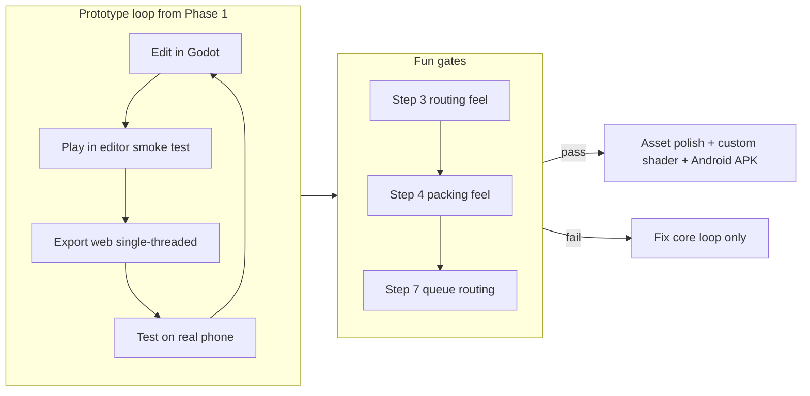

# Packtory — Development Plan

*Derived from [warehouse-game-concept.md](./warehouse-game-concept.md). Godot 4.6, GL Compatibility, GDScript. Folder layout is also documented in the concept doc under **Project structure**.*

---

## Project Overview

**Packtory** (working title: *Warehouse*) is a **mobile-first, real-time 3D order-fulfillment game** — think *Good Pizza, Great Pizza* / *Overcooked* tension plus Satisfactory-style layout optimization.

| Pillar | Description |
|--------|-------------|
| **Core fantasy** | Run a warehouse: pick from shelves, pack orders, serve walk-ins, ship dispatch |
| **Moment-to-moment skill** | Tap-to-queue walking routes through the floor (a live traveling-salesman puzzle) |
| **Meta skill** | Shelf placement and floor layout — scaling should keep breaking your optimal plan |
| **Long arc** | Hand-picking → hiring workers → managing exceptions as the "real" manager game |
| **Tone** | Cozy tycoon — bad days cost money, not a game-over |

### Tech Stack (aligned with concept doc)

- **Engine:** Godot 4.6 + GDScript (web export requires GDScript, not C#)
- **Renderer:** GL Compatibility — single path for web + Android
- **Visuals:** Isometric orthographic 3D with **basic `.glb` assets from Phase 1** (floor, shelves, worker) — real low-poly art, not primitive cubes; custom shader deferred until polish pass
- **Warehouse:** Data-driven grid from day one (expansion = grow the grid)
- **Input / hit-testing:** Raycast from camera to detect tapped shelf/cell — default Godot physics is enough; no rigid-body simulation

### Locked Technical Decisions

| Decision | Choice | Rationale |
|----------|--------|-----------|
| **Pathfinding** | `AStarGrid2D` in 2D cell space, mapped to 3D world positions | Game is grid-native; routing puzzle is defined in cells. Nav meshes add imprecision. Decide before Phase 2. |
| **Physics engine** | None beyond raycasts | Grid pathfinding + tap selection only. Jolt/rigid bodies never enter this game. |
| **Touch validation** | Real phone from Phase 1–2 | Editor mouse does not catch multitouch, fat-finger, or gesture clashes. |
| **Scripts** | Created when their phase needs them | Folders in Phase 0; no empty stubs for systems weeks away. |
| **event_bus** | Cross-cutting signals only | e.g. order fulfilled, day ended — not the default wiring for everything. |
| **Worker movement** | Queue-consumer from Phase 2 | `worker.gd` executes a list of actions/waypoints from day one (length 1 initially). Phase 7's `action_queue.gd` only *builds* longer lists — no movement rewrite. |

### Current Repo State

Fresh Godot 4.6 project with concept doc only — no gameplay scenes yet.

---

## Suggested Project Structure

The concept doc lists **scene names**; below is a fuller Godot layout that scales through MVP and beyond without rewrites.

```
packtory/
├── docs/
│   ├── warehouse-game-concept.md          # design bible
│   └── dev-plan.md                        # this file
│
├── scenes/
│   ├── main/
│   │   └── main.tscn                      # root orchestrator, scene switching
│   │
│   ├── warehouse/
│   │   ├── warehouse.tscn                 # iso grid, floor, camera, object layer
│   │   ├── shelf.tscn                     # instanced shelf unit
│   │   ├── pack_desk.tscn                 # floor trigger → packing UI
│   │   ├── worker.tscn                    # avatar / hired worker
│   │   └── customer.tscn                  # queue line entity
│   │
│   ├── ui/
│   │   ├── hud.tscn                       # money, timer, order list (CanvasLayer)
│   │   ├── packing_screen.tscn          # sort haul into orders
│   │   ├── end_of_day_screen.tscn       # revenue − expenses
│   │   └── exception_popup.tscn           # wait / cancel / substitute (step 8)
│   │
│   └── camera/
│       └── iso_camera_rig.tscn            # ortho cam + pan/zoom input
│
├── scripts/                               # folders in Phase 0; .gd files added per phase (see table)
│   ├── autoload/
│   ├── warehouse/
│   ├── actors/
│   ├── systems/
│   ├── input/
│   └── ui/
│
├── resources/
│   ├── data/
│   │   ├── products/                      # ProductData .tres (SKU, name, mesh ref)
│   │   ├── orders/                        # OrderTemplate .tres
│   │   └── upgrades/                      # later: cart, desk slots, shelf levels
│   │
│   ├── configs/
│   │   ├── game_balance.tres              # carry cap, patience rates, day length
│   │   └── warehouse_default.tres         # starting grid size, shelf layout seed
│   │
│   └── themes/
│       └── ui_theme.tres
│
├── assets/
│   ├── models/                            # basic .glb from Phase 1 (floor, shelf, worker, desk)
│   ├── textures/
│   └── audio/
│
├── shaders/                               # post art pass only (after step 7 gate)
│
└── export/
    ├── export_presets.cfg                 # web (single-threaded), Android
    └── web/                               # itch.io / GitHub Pages output (gitignored)
```

### Design Principles

1. **Scenes = things in the world; scripts/systems = rules** — keeps `main.tscn` thin.
2. **Grid is data, not mesh** — `grid_service` + `grid_floor` own dimensions and cell occupancy from step 1.
3. **Worker is a queue-consumer from Phase 2** — `worker.gd` runs an ordered list of actions (walk, grab, deposit). Early phases pass a list of length 1; Phase 7's `action_queue.gd` builds longer lists into the same executor — purely additive.
4. **Resources for tunables** — carry capacity, patience, day length live in `.tres` so balance can iterate without code changes.
5. **Autoloads stay minimal** — add only when a phase needs them; avoid a "god autoload" that knows everything.
6. **event_bus for cross-cutting signals only** — order fulfilled, day ended. Direct calls for local flow so debugging stays traceable.
7. **Basic assets from Phase 1** — import minimal `.glb` meshes early so iso scale, tap targets, and art direction are real from the start; polish and expand after the step 7 gate.

### Scripts by Phase

Create files when the phase starts — do not scaffold empty stubs ahead of time.

| Phase | Add |
|-------|-----|
| **0** | Folder tree only |
| **1** | `grid_service.gd` (autoload), `warehouse.gd`, `grid_floor.gd`, `camera_controller.gd`, `touch_input.gd` |
| **2** | `pathfinding.gd` (`AStarGrid2D`), `worker.gd` (action-list executor — single action early) |
| **3** | `shelf.gd`, `pack_desk.gd`, inventory logic; auto-return = append deposit action to worker's list |
| **4** | `packing_screen.gd` + scene |
| **5** | `customer.gd`, `order_system.gd`, `hud.gd`; `event_bus.gd` if cross-scene signals needed |
| **6** | `game_state.gd` (autoload), `day_cycle.gd`, `economy.gd`, `end_of_day_screen.gd` |
| **7** | `action_queue.gd` (multi-tap route builder + reorder UI → feeds worker's existing executor) |
| **8** | `exception_system.gd`, `exception_popup.gd` |

### Scene Build Order (from concept doc)

**Start with:**

- **Main** — root orchestrator: game state, day cycle, money.
- **Warehouse** — the iso grid, floor, and camera (pan/zoom). The playable space.

For Phase 1 you only need **Main + Warehouse + iso_camera_rig**. Shelf, worker, and pack desk scenes arrive with their gameplay phases (2–4). **HUD** waits until Phase 5 — nothing to display until orders exist.

---

## Development Plan

The concept doc's **MVP build order is the spine**. Phases below add gates and explicit "do not build yet" boundaries.

### Phase 0 — Project Skeleton (~½ day)

- Create folder tree above (empty scenes OK — no script stubs for future phases).
- Set export preset for **web, single-threaded** (browser prototype loop).
- Import or source **minimal `.glb` assets** for floor tiles, shelf, and worker (basic low-poly is fine — visuals matter from day one).

**Exit criteria:** Empty `main.tscn` runs, camera rig scene exists, asset folder populated with starter meshes.

---

### Phase 1 — Iso Scene + Camera (MVP Step 1)

**Goal:** Move around a warehouse-sized space before any gameplay.

- `warehouse.tscn`: procedural floor from grid dimensions (e.g. 12×12) using floor tile assets.
- `grid_service`: cell dimensions, world ↔ cell mapping (foundation for pathfinding in Phase 2).
- Shelf/worker meshes placed as static dressing (interaction comes in Phase 2–3).
- `iso_camera_rig`: orthographic, fixed iso angle.
- Input: drag = pan, pinch/wheel = zoom; tap vs drag must not conflict.
- **Export web build → test pan/zoom on a real phone the same day** (not just editor mouse).

**Exit criteria:** Smooth pan/zoom over a grid larger than one screen; gestures feel right on device; iso scale reads correctly with real assets.

---

### Phase 2 — Tap-to-Move (MVP Step 2)

**Goal:** One avatar, one tap target — **built as a queue-consumer from the start.**

- `pathfinding.gd`: `AStarGrid2D` on the same cell grid as `grid_service`; path → 3D waypoints.
- `worker.gd`: executes an **ordered action list** (walk-to-cell, later grab/deposit). A single tap enqueues one action — list length 1, same code path Phase 7 will extend.
- Worker uses imported mesh (not a capsule primitive).
- Tap cell/shelf → raycast hit → enqueue walk action → worker runs the list.
- Short tap = action; drag = camera (reuse Phase 1 input).
- **Re-test on phone** — tap-vs-drag and fat-finger taps are the core control model.

**Exit criteria:** Character reliably paths to tapped tiles via the action executor; camera never steals taps; touch feels good on device.

---

### Phase 3 — Picking + Capacity (MVP Step 3) — First Fun Gate

**Goal:** Routing feel test.

- Shelves with 1–2 SKUs; tap shelf → enqueue grab action on worker's list.
- Full inventory → append return + deposit actions to the same list (not a separate movement hack).
- Deposit at desk clears inventory.

**Kill-or-continue question:** Does clever tap-order feel rewarding?

---

### Phase 4 — Packing Screen (MVP Step 4) — Second Fun Gate

**Goal:** Order assignment happens at desk, not shelf.

- Tap pack desk → approach → button opens `packing_screen`.
- Sort gathered items into order slots; confirm → order marked ready.
- Prototype both "button opens UI" and pure-queue version; pick winner based on feel.

**Kill-or-continue question:** Is sorting satisfying or tedious?

---

### Phase 5 — Customer Line (MVP Step 5)

- Queue of customers with patience meters.
- Fulfilled packed order → money + customer leaves.
- Impatience drains over time; failed patience = lost sale.

**Exit criteria:** Pick → pack → serve loop works end-to-end with one customer type.

---

### Phase 6 — Day Cycle (MVP Step 6)

- Game timer (compressed 8am–22pm).
- End-of-day screen: revenue − basic expenses.
- Persistent money between days (save optional for now — in-memory OK for prototype).

**Exit criteria:** One full "day" session in a few real minutes.

---

### Phase 7 — Tap-to-Queue Routes (MVP Step 7) — Core Skill Gate

**Goal:** The doc's hook — routing as skill. **Purely additive** on the Phase 2 executor.

- `action_queue.gd`: multi-tap builds an ordered route; drag-to-reorder or "do next" to prioritize.
- Feeds a longer action list into `worker.gd`'s existing executor — no movement refactor.
- Queue order = walking path.

**Main kill-or-continue gate (steps 3–7):** If gather → pack → serve + routing don't feel good, **stop and fix core** before anything below.

---

### Phase 8 — First Worker + First Exception (MVP Step 8)

- One hired worker: hardcoded loop (gather → pack desk → hand off).
- One exception type: out-of-stock → wait / cancel.
- Alert icon over worker; tap to resolve.

**Exit criteria:** Proof that "manager handles exceptions" has legs.

---

### Phase 9 — Polish Slice & Platform Check

- Juice only where it helps feel (sound stubs, UI polish) — core meshes already in place.
- Re-export web + **Android APK** — confirm parity with phone-browser testing done since Phase 1–2.
- Tune balance via `game_balance.tres`.
- **Visual polish (post step 7 gate):** refined `.glb` assets, environment dressing, optional `flat_shaded.gdshader` for baked-AO look.

---

## Explicitly Post-MVP

**Do not build until Phase 7 gate passes.**

| Feature | Why wait |
|---------|----------|
| Dispatch & vehicles | Different puzzle layer |
| Full hiring / automation tree | Depends on worker loop feeling good |
| Unmet-demand product unlocks | Needs stable order economy |
| Restock lead times | Mid-game depth |
| Box-size selection | Micro-decision layer |
| Desk-slot pre-staging upgrades | Predictive prep meta |
| Environment dressing (garden, street) | Atmosphere only |
| Layout-optimization economy | Meta progression after core loop |
| Drones, VIP exceptions, full exception tree | Manager-game depth |

---

## Recommended Workflow



### Workflow Rules

1. **Basic assets from Phase 0–1** — minimal `.glb` meshes (floor, shelf, worker, desk); iterate on art after the step 7 gate, not before gameplay exists.
2. **Web first for iteration** — instant shareable builds on itch.io; no compile wait.
3. **Real phone from Phase 1** — editor mouse is not a substitute for touch; re-test after Phase 2 tap work. Get the web build on your phone the same day pan/zoom land.
4. **One renderer** — stay on GL Compatibility; custom shaders deferred to polish pass.
5. **Grid-first warehouse** — `AStarGrid2D` on the same cell model as placement and routing.
6. **Worker executes action lists from Phase 2** — never build a single-target mover that Phase 7 has to rip out.
7. **Export web single-threaded** — avoids SharedArrayBuffer / COOP/COEP hosting headaches.

---

## Summary

| Item | Recommendation |
|------|----------------|
| **Project name** | `packtory` |
| **First scenes** | `main`, `warehouse`, `iso_camera_rig` (HUD at Phase 5) |
| **First systems** | `grid_service`, touch input, worker action-list executor, `AStarGrid2D` pathfinding |
| **First milestone** | Pan/zoom iso grid with real assets on phone; then tap-to-move via action list |
| **Main risk** | Single-target movement in Phase 2 that Phase 7 must rewrite; or validating touch in editor only |
| **Success metric** | After step 7, you *want* to optimize your tap route — that's the game |

### Next Coding Session

**Phase 0 + Phase 1 only:** folder structure (no future script stubs), starter `.glb` assets, `main.tscn`, `grid_service`, data-driven grid floor with real floor tiles, camera pan/zoom with tap/drag separation, web export on a real phone the same day.
